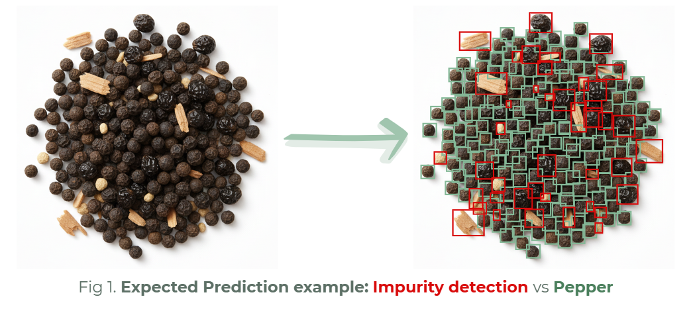

# YOLOv8 for Nondestructive Black Pepper Impurity Detection

🚀 First-author research project presented at the IEEE International Conference on Advances in ICT for Emerging Regions (ICTer) 2025.

---

## 📌 Overview

Food adulteration in spices like black pepper is a major issue affecting quality, safety, and economic value—especially in countries like Sri Lanka.

Traditional laboratory-based detection methods (e.g., HPLC, NIR, GC-MS) are:

* Expensive
* Time-consuming
* Destructive

👉 This project introduces a **non-destructive, computer vision-based solution** using YOLOv8 to detect impurities directly from images.

---

## 🎯 Problem Statement

Detect and localize foreign impurities (e.g., papaya seeds, sand, wood particles) in black pepper samples using image-based object detection.

---

## 🧠 Approach

* **Model**: YOLOv8s (Ultralytics)
* **Task**: Object Detection
* **Framework**: PyTorch
* **Annotation Tool**: Roboflow

### Classes:

* Pure Black Pepper
* Impurity

### Pipeline:

1. Image collection using mobile camera
2. Annotation using Roboflow
3. Preprocessing:

   * Resize to 640×640
   * Adaptive contrast enhancement
4. Data Augmentation:

   * Horizontal & vertical flips
   * Random rotations
   * Brightness & hue shifts
   * Mosaic augmentation
5. Model Training:

   * 100 epochs
   * Batch size: 16
   * Optimizer: SGD

---

## 📊 Dataset

* **Total Images**: 526
* **Total Annotations**: ~37,900 objects
* **Class Distribution**:

  * ~96% Pure Pepper
  * ~4% Impurity

⚠️ Significant class imbalance reflecting real-world conditions.

---

## 📈 Results

| Metric       | Score     |
| ------------ | --------- |
| mAP@0.5      | **0.952** |
| mAP@0.5:0.95 | **0.712** |
| Precision    | 0.968     |
| Recall       | 0.919     |
| F1 Score     | ~0.943    |

### Class-wise Performance:

* **Impurity Detection**:

  * mAP@0.5:0.95 = 0.608
* **Pure Black Pepper**:

  * mAP@0.5:0.95 = 0.815

✅ High detection accuracy
✅ Strong generalization despite imbalance
✅ Reliable localization of impurities

---

## 🆚 YOLOv8 vs YOLOv11

| Model    | mAP@0.5   | mAP@0.5:0.95 |
| -------- | --------- | ------------ |
| YOLOv8s  | **0.952** | **0.712**    |
| YOLOv11s | 0.942     | 0.691        |

👉 YOLOv8 demonstrated superior performance, especially in impurity detection, making it more suitable for safety-critical applications.

---

## 🖼️ Sample Output



Example:

* Bounding boxes highlight:

  * Impurities (foreign particles)
  * Pepper seeds

---

## ⚙️ Installation & Setup

```bash
git clone https://github.com/your-username/pepper-impurity-detection-yolov8
cd pepper-impurity-detection-yolov8
pip install -r requirements.txt
```

---

## ▶️ Usage

```bash
python predict.py --source path/to/image.jpg
```

Output:

* Image with bounding boxes
* Detected objects with confidence scores

---

## 📁 Project Structure

```
pepper-impurity-detection-yolov8/
│── data/
│── models/
│── notebooks/
│── src/
│── results/
│── predict.py
│── requirements.txt
│── README.md
```

---

## 📄 Publication

**YOLOv8 for Nondestructive Black Pepper Impurity Detection**
Presented at IEEE ICTer 2025
**First Author**

[IEEE link]([https://orcid.org/0009-0001-6027-6936](https://icter.lk/downloads/ICTer2025-Book-of-Abstracts.pdf))

---

## 🚀 Future Work

* Improve impurity detection precision (reduce false positives)
* Address class imbalance with more diverse impurity samples
* Optimize model for mobile/edge deployment
* Develop a real-time mobile application
* Explore hybrid YOLOv8 + YOLOv11 architectures

---

## 💡 Key Contributions

* Developed a **non-destructive impurity detection system**
* Created a **custom annotated dataset** for black pepper adulteration
* Achieved **high detection accuracy using YOLOv8**
* Demonstrated feasibility of **real-time field deployment**

---

## 🛠️ Tech Stack

* Python
* PyTorch
* YOLOv8 (Ultralytics)
* Roboflow
* OpenCV

---

## 👩‍💻 Author

First Author – IEEE ICTer 2025 Publication

---

## ⭐ Acknowledgements

Thanks to the open-source community and tools that made this work possible.

---

## 📌 Note

This project is based on published research and is intended for academic and practical applications in food safety and quality inspection.
